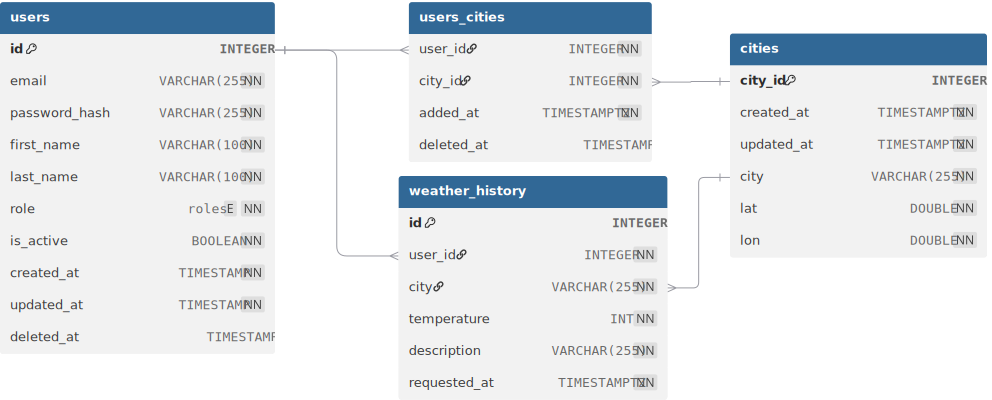

# Домашнее задание 4

## Database Schema

[](https://dbdiagram.io/d/rbk-weather-api-69ef55e7c6a36f9c1b925ccc)

## REST API

### Register

```bash
curl -X POST http://localhost:8080/auth/register \
  -H "Content-Type: application/json" \
  -d '{"email":"bayan@example.com","password":"tramp",
        "first_name": "Bayan", "last_name": "User",
        "is_active": true}'
```

### Login

```bash
curl -X POST http://localhost:8080/auth/login \
  -H "Content-Type: application/json" \
  -d '{"email":"admin@example.com","password":"admin123"}'
```


### Добавить город пользователю

```bash
curl -X POST http://localhost:8080/api/v1/users/1/cities \
  -H "Content-Type: application/json" \
  -d '{
    "city": "Almaty"
  }'
```

### Список городов пользователя

```bash
curl -X GET http://localhost:8080/api/v1/users/1/cities
```

### Удалить город

```bash
curl -X DELETE http://localhost:8080/api/v1/users/1/cities/3
```

### Получить погоду по всем городам пользователя

```bash
curl -X GET http://localhost:8080/api/v1/users/1/weather
```

### Получить историю с фильтрацией

```bash
curl -X GET http://localhost:8080/api/v1/users/1/weather/history?city=astana"
```


## References 

- [Database Schema](https://dbdiagram.io/d/rbk-weather-api-69ef55e7c6a36f9c1b925ccc)
- [Json to Go Struct](https://transform.tools/json-to-go)
- [Geocoding API](https://open-meteo.com/en/docs/geocoding-api)
- [Welcome to Nominatim](https://nominatim.openstreetmap.org/ui/search.html)
- [Bcrypt Hash Generator](https://bcrypt-generator.com)